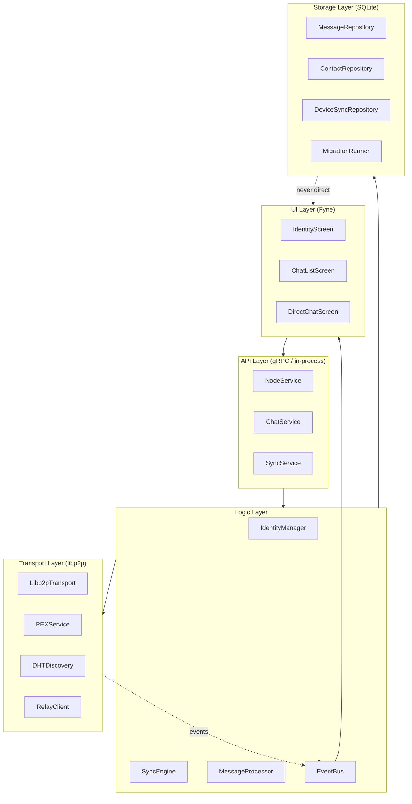
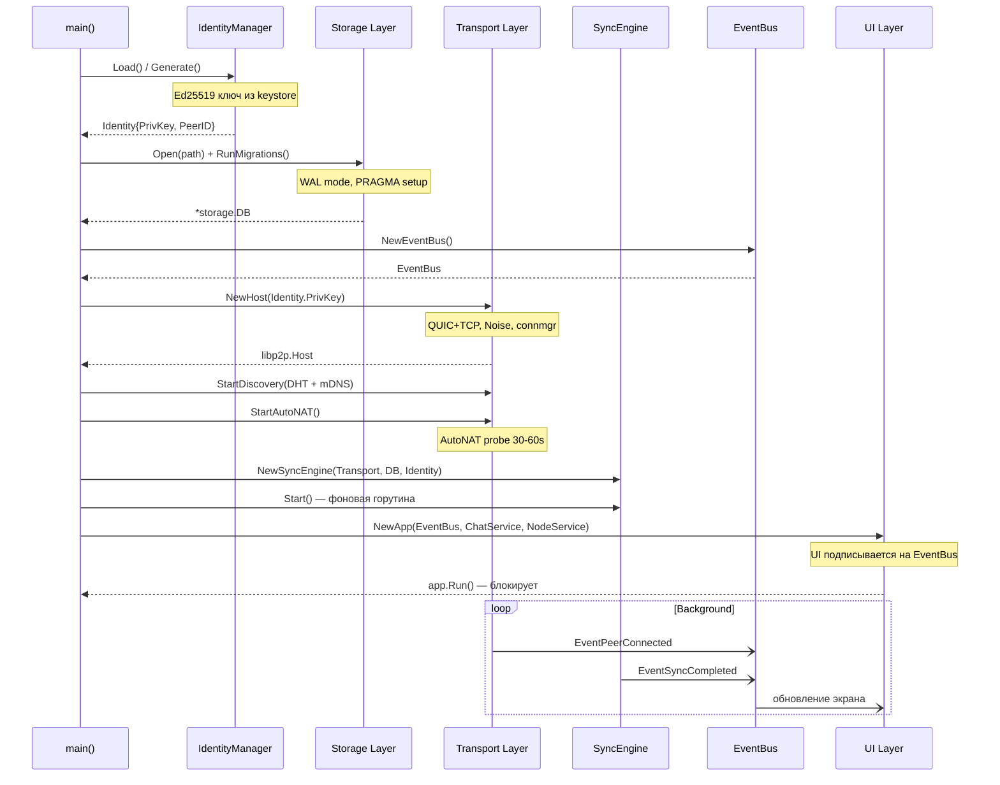
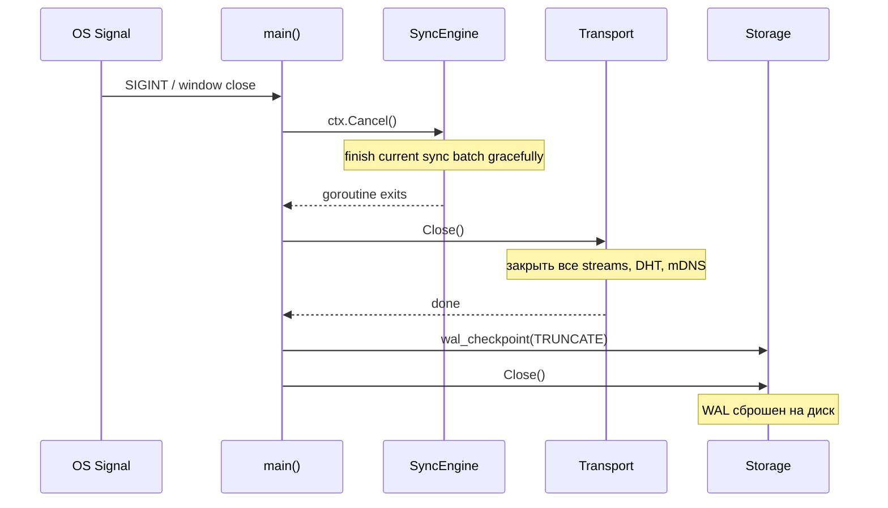
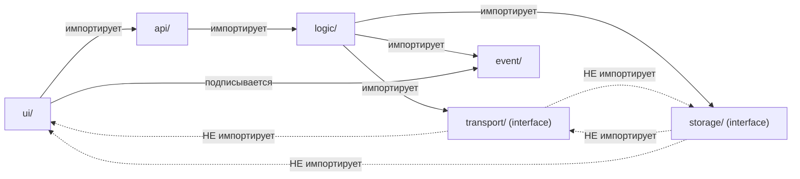

# 02_DES_architecture_v1.md — Архитектура приложения Aether v1

**Статус:** Design / Draft  
**Дата:** 2026-03-17  
**Зависит от:** `01_RES_libp2p_stack.md`, `01_RES_sqlite_p2p_consistency.md`

---

## Оглавление

1. [Обзор слоёв](#1-обзор-слоёв)
2. [Ключевые Go-интерфейсы](#2-ключевые-go-интерфейсы)
3. [Жизненный цикл запуска](#3-жизненный-цикл-запуска)
4. [Структура пакетов](#4-структура-пакетов)
5. [Принцип слабой связанности](#5-принцип-слабой-связанности)

---

## 1. Обзор слоёв

### 1.1 Диаграмма слоёв



### 1.2 Описание слоёв

| Слой | Пакет Go | Ответственность | Зависит от |
|---|---|---|---|
| **UI Layer** | `internal/ui` | Отображение, пользовательский ввод, Fyne widgets | API Layer, EventBus |
| **API Layer** | `internal/api` | gRPC (или in-process RPC), сериализация запросов/ответов | Logic Layer |
| **Logic Layer** | `internal/logic` | Бизнес-логика: синхронизация, Identity, маршрутизация сообщений | Transport, Storage, EventBus |
| **Transport Layer** | `internal/transport` | libp2p host, DHT, PEX, Relay — всё что связано с сетью | Только stdlib + libp2p |
| **Storage Layer** | `internal/storage` | SQLite CRUD, миграции, репозитории | Только `modernc.org/sqlite` |

**Правило:** Каждый слой зависит **только от слоя ниже**. Transport Layer **не знает** о Fyne. Storage Layer **не знает** о libp2p.

---

## 2. Ключевые Go-интерфейсы

### 2.1 Transport Layer

```go
package transport

import (
    "context"
    "github.com/libp2p/go-libp2p/core/peer"
)

// MessageTransport — абстракция сетевого транспорта.
// Реализации: Libp2pTransport (production), MockTransport (тесты).
type MessageTransport interface {
    // Send отправляет зашифрованный payload конкретному peer.
    Send(ctx context.Context, to peer.ID, payload []byte) error

    // Subscribe регистрирует обработчик входящих сообщений.
    Subscribe(handler IncomingHandler)

    // Connect устанавливает соединение с peer (может использовать relay).
    Connect(ctx context.Context, info peer.AddrInfo) error

    // Reachability возвращает текущий статус NAT (Public/Private/Unknown).
    Reachability() NetworkReachability

    // Close завершает работу транспорта, закрывает все соединения.
    Close() error
}

// IncomingHandler — колбек для входящих сообщений.
type IncomingHandler func(from peer.ID, payload []byte)

// NetworkReachability — результат AutoNAT probe.
type NetworkReachability int

const (
    ReachabilityUnknown NetworkReachability = iota
    ReachabilityPublic
    ReachabilityPrivate
)

// PeerDiscovery — абстракция обнаружения пиров.
type PeerDiscovery interface {
    // FindPeer ищет peer по его ID (DHT lookup).
    FindPeer(ctx context.Context, id peer.ID) (peer.AddrInfo, error)

    // Announce анонсирует себя в сети под данным namespace.
    Announce(ctx context.Context, namespace string) error

    // FindPeers возвращает канал обнаруженных пиров для namespace.
    FindPeers(ctx context.Context, namespace string) (<-chan peer.AddrInfo, error)
}
```

### 2.2 Storage Layer

```go
package storage

import (
    "context"
    "time"
)

// MessageRepository — операции с сообщениями.
type MessageRepository interface {
    // Save сохраняет новое сообщение (идемпотентно: INSERT OR IGNORE).
    Save(ctx context.Context, msg *Message) error

    // GetSince возвращает сообщения после globalSeq для данного чата.
    GetSince(ctx context.Context, conversationID string, afterSeq int64, limit int) ([]*Message, error)

    // MarkDelivered обновляет статус сообщения.
    MarkDelivered(ctx context.Context, messageID string, deviceID string) error

    // GetConversations возвращает список чатов с последним сообщением.
    GetConversations(ctx context.Context) ([]*ConversationSummary, error)
}

// DeviceSyncRepository — управление состоянием синхронизации.
type DeviceSyncRepository interface {
    // GetLastSeq читает последний подтверждённый global_seq для устройства.
    GetLastSeq(ctx context.Context, deviceID, conversationID string) (int64, error)

    // UpdateLastSeq атомарно обновляет прогресс синхронизации.
    UpdateLastSeq(ctx context.Context, deviceID, conversationID string, seq int64) error
}

// ContactRepository — управление контактами.
type ContactRepository interface {
    // Add добавляет доверенный контакт.
    Add(ctx context.Context, contact *Contact) error

    // GetAll возвращает все контакты пользователя.
    GetAll(ctx context.Context) ([]*Contact, error)

    // UpdateAddr обновляет последний известный multiaddress контакта.
    UpdateAddr(ctx context.Context, peerID string, addr string) error
}
```

### 2.3 Logic Layer

```go
package logic

import "context"

// IdentityManager — управление Ed25519-ключами и DeviceID.
type IdentityManager interface {
    // Generate создаёт новую пару ключей и сохраняет в keystore.
    Generate() (*Identity, error)

    // Load загружает существующий ключ из keystore.
    Load() (*Identity, error)

    // Sign подписывает данные приватным ключом.
    Sign(data []byte) ([]byte, error)

    // Verify проверяет Ed25519-подпись.
    Verify(publicKey []byte, data, signature []byte) bool

    // DeviceID возвращает строковый PeerID текущего устройства.
    DeviceID() string
}

// SyncEngine — механизм синхронизации с Personal Node.
type SyncEngine interface {
    // Sync инициирует синхронизацию с Personal Node.
    // Запрашивает все сообщения после last_synced_seq.
    Sync(ctx context.Context) error

    // SetPersonalNode устанавливает адрес Personal Node.
    SetPersonalNode(nodeID string, addr string)

    // OnSynced регистрирует колбек на завершение синхронизации.
    OnSynced(handler func(newMessages int))
}

// MessageProcessor — маршрутизация и обработка входящих сообщений.
type MessageProcessor interface {
    // Process проверяет, дешифрует и сохраняет входящее сообщение.
    Process(ctx context.Context, senderID string, payload []byte) error

    // Send шифрует и отправляет сообщение получателю.
    Send(ctx context.Context, to string, text string) error
}
```

### 2.4 EventBus — развязка слоёв

```go
package event

// EventBus — in-process publish/subscribe шина для развязки слоёв.
// Transport и Logic публикуют события; UI подписывается.
// Реализация: channel-based, НЕ блокирующая отправителя.
type EventBus interface {
    // Publish публикует событие. Не блокирует если нет подписчиков.
    Publish(event Event)

    // Subscribe возвращает канал событий указанного типа.
    // ctx используется для отмены подписки.
    Subscribe(ctx context.Context, eventType EventType) <-chan Event
}

// EventType — типы событий системы.
type EventType string

const (
    EventMessageReceived  EventType = "message.received"
    EventMessageDelivered EventType = "message.delivered"
    EventMessageRead      EventType = "message.read"
    EventPeerConnected    EventType = "peer.connected"
    EventPeerDisconnected EventType = "peer.disconnected"
    EventSyncCompleted    EventType = "sync.completed"
    EventNodeReachability EventType = "node.reachability"
)

// Event — базовая структура события.
type Event struct {
    Type    EventType
    Payload any // конкретный тип зависит от EventType
}

// MessageReceivedPayload — payload для EventMessageReceived.
type MessageReceivedPayload struct {
    MessageID      string
    ConversationID string
    SenderID       string
    Text           string // уже дешифрованный
    ReceivedAt     time.Time
}
```

### 2.5 API Layer (gRPC / In-process)

```go
// Для монолитного desktop-приложения API Layer реализуется как in-process вызовы.
// При выделении Personal Node в отдельный бинарник — gRPC через Unix socket или loopback.

package api

// NodeService — управление состоянием ноды.
type NodeService interface {
    // GetStatus возвращает текущий статус: reachability, peer count, sync state.
    GetStatus(ctx context.Context) (*NodeStatus, error)

    // SetPersonalNode связывает устройство с Personal Node.
    SetPersonalNode(ctx context.Context, req *SetPersonalNodeRequest) error
}

// ChatService — основные операции с чатами.
type ChatService interface {
    // ListConversations возвращает список чатов.
    ListConversations(ctx context.Context) ([]*ConversationDTO, error)

    // GetMessages возвращает историю сообщений с пагинацией.
    GetMessages(ctx context.Context, req *GetMessagesRequest) ([]*MessageDTO, error)

    // SendMessage отправляет сообщение.
    SendMessage(ctx context.Context, req *SendMessageRequest) (*MessageDTO, error)
}
```

---

## 3. Жизненный цикл запуска

### 3.1 Диаграмма инициализации



### 3.2 Порядок инициализации (код)

```go
package main

import (
    "context"
    "log"
    "os"
    "os/signal"

    "github.com/user/aether/internal/api"
    "github.com/user/aether/internal/event"
    "github.com/user/aether/internal/logic"
    "github.com/user/aether/internal/storage"
    "github.com/user/aether/internal/transport"
    "github.com/user/aether/internal/ui"
)

func main() {
    ctx, stop := signal.NotifyContext(context.Background(), os.Interrupt)
    defer stop()

    // 1. Identity — первым, так как нужен для всех остальных компонентов
    idMgr := logic.NewIdentityManager(datadir("identity.key"))
    identity, err := idMgr.Load()
    if err != nil {
        identity, err = idMgr.Generate()
        must(err, "generate identity")
    }
    log.Printf("node started: %s", identity.DeviceID)

    // 2. Storage — до поднятия сети (не должны терять сообщения)
    db, err := storage.Open(datadir("aether.db"))
    must(err, "open db")
    must(storage.RunMigrations(db), "run migrations")
    defer db.Close()

    msgRepo := storage.NewMessageRepository(db)
    syncRepo := storage.NewDeviceSyncRepository(db)
    contactRepo := storage.NewContactRepository(db)

    // 3. EventBus — до всех компонентов что публикуют события
    bus := event.NewEventBus(ctx)

    // 4. Transport — поднимаем P2P-хост
    t, err := transport.NewLibp2pTransport(ctx, transport.Config{
        PrivateKey:  identity.PrivKey,
        EnableRelay: true,
    })
    must(err, "start transport")
    defer t.Close()

    // Пробрасываем события AutoNAT в EventBus
    t.OnReachabilityChange(func(r transport.NetworkReachability) {
        bus.Publish(event.Event{
            Type:    event.EventNodeReachability,
            Payload: r,
        })
    })

    // 5. Logic — SyncEngine, MessageProcessor
    proc := logic.NewMessageProcessor(t, msgRepo, contactRepo, bus, identity)
    t.Subscribe(proc.HandleIncoming) // регистрируем обработчик входящих

    syncEngine := logic.NewSyncEngine(t, msgRepo, syncRepo, identity)
    go syncEngine.Start(ctx)

    // 6. API Layer (in-process)
    chatSvc := api.NewChatService(msgRepo, contactRepo, proc)
    nodeSvc := api.NewNodeService(t, syncEngine)

    // 7. UI — последним, блокирует main goroutine
    app := ui.NewApp(ui.Config{
        EventBus: bus,
        Chat:     chatSvc,
        Node:     nodeSvc,
    })
    app.Run() // блокирует до закрытия окна
}

func must(err error, msg string) {
    if err != nil {
        log.Fatalf("%s: %v", msg, err)
    }
}
```

### 3.3 Shutdown sequence



---

## 4. Структура пакетов

```
aether/
├── cmd/
│   ├── aether/           # desktop: main() с Fyne UI
│   │   └── main.go
│   └── aetherd/          # personal node daemon (без UI)
│       └── main.go
├── internal/
│   ├── event/            # EventBus (канальный pub/sub)
│   │   ├── bus.go
│   │   └── types.go
│   ├── identity/         # Ed25519 ключи, keystore
│   │   ├── manager.go
│   │   └── keystore.go
│   ├── transport/        # libp2p абстракция
│   │   ├── interface.go  # MessageTransport, PeerDiscovery
│   │   ├── libp2p.go     # Libp2pTransport
│   │   ├── mock.go       # MockTransport для тестов
│   │   ├── pex.go        # PEX сервис
│   │   └── discovery.go  # DHT + mDNS
│   ├── storage/          # SQLite репозитории
│   │   ├── db.go         # Open(), WAL, PRAGMA
│   │   ├── migrations/   # *.up.sql / *.down.sql
│   │   ├── messages.go
│   │   ├── contacts.go
│   │   └── sync_state.go
│   ├── logic/            # бизнес-логика
│   │   ├── processor.go  # MessageProcessor
│   │   ├── sync.go       # SyncEngine
│   │   └── crypto.go     # шифрование payload
│   ├── api/              # in-process / gRPC сервисы
│   │   ├── chat.go
│   │   └── node.go
│   └── ui/               # Fyne UI (только здесь знают о Fyne)
│       ├── app.go
│       ├── screens/
│       │   ├── identity.go
│       │   ├── chatlist.go
│       │   └── directchat.go
│       └── viewmodel/    # Observable state
│           ├── chat_vm.go
│           └── node_vm.go
├── proto/                # Protobuf определения
│   └── aether/
│       ├── sync.proto
│       └── message.proto
├── go.mod
└── go.sum
```

---

## 5. Принцип слабой связанности

### 5.1 Правила зависимостей



### 5.2 Enforcing с помощью go build constraints

Для предотвращения случайного импорта Fyne в P2P-код:

```go
// internal/transport/libp2p.go — запрет зависимостей от ui/*
// Явной проверки нет, но структура пакетов + code review достаточны.
// В CI: запустить "go list -deps ./internal/transport/..." и проверить отсутствие "fyne.io"

// Тест на нарушение зависимостей в CI:
// $ go list -f '{{range .Imports}}{{println .}}{{end}}' ./internal/transport/... | grep fyne
// Должен вернуть пустой результат.
```

### 5.3 Тестируемость через интерфейсы

```go
// MockTransport позволяет тестировать Logic Layer без реальной P2P-сети.
type MockTransport struct {
    SentMessages []SentMessage
    SimulateIncoming func(from peer.ID, payload []byte)
}

func (m *MockTransport) Send(ctx context.Context, to peer.ID, payload []byte) error {
    m.SentMessages = append(m.SentMessages, SentMessage{To: to, Payload: payload})
    return nil
}

// Пример теста:
func TestMessageProcessor_ProcessAndStore(t *testing.T) {
    mock := &MockTransport{}
    db := storage.OpenInMemory() // SQLite :memory:
    proc := logic.NewMessageProcessor(mock, db.Messages(), ...)

    err := proc.Process(ctx, "senderPeerID", testPayload)
    assert.NoError(t, err)
    msgs, _ := db.Messages().GetSince(ctx, "conv1", 0, 10)
    assert.Len(t, msgs, 1)
}
```

---

*Следующий документ: `02_DES_sync_protocol.md` — детальное описание протокола синхронизации.*
