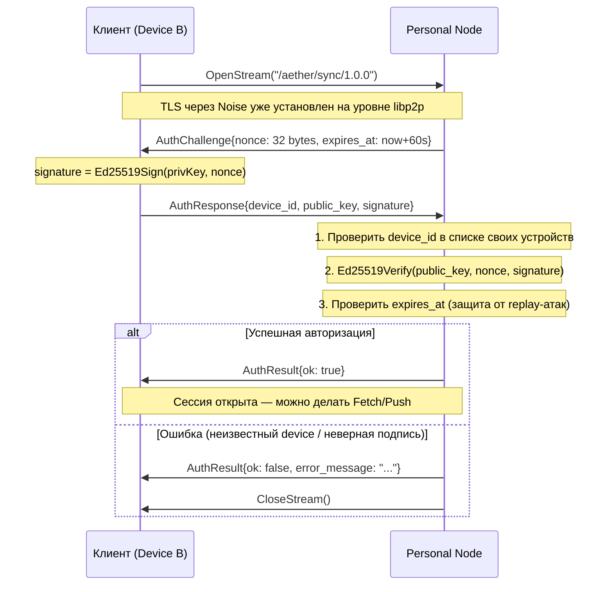
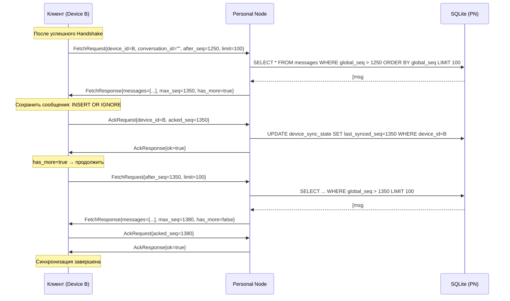
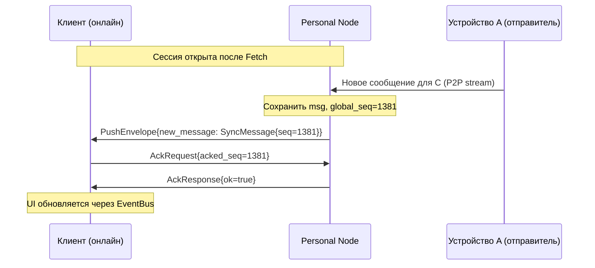

# 02_DES_sync_protocol.md — Протокол синхронизации Aether

**Статус:** Design / Draft  
**Дата:** 2026-03-17  
**Зависит от:** `01_RES_sqlite_p2p_consistency.md`, `02_DES_architecture_v1.md`

---

## Оглавление

1. [Protobuf-структуры сообщений](#1-protobuf-структуры-сообщений)
2. [Handshake: авторизация на Personal Node](#2-handshake-авторизация-на-personal-node)
3. [Алгоритм Fetch](#3-алгоритм-fetch)
4. [Push: доставка в реальном времени](#4-push-доставка-в-реальном-времени)
5. [Обработка ошибок и повторные попытки](#5-обработка-ошибок-и-повторные-попытки)

---

## 1. Protobuf-структуры сообщений

### 1.1 Определения proto-файлов

```protobuf
// proto/aether/sync.proto
syntax = "proto3";
package aether.sync.v1;
option go_package = "github.com/user/aether/proto/aether/sync/v1;syncv1";

// ── Handshake ──────────────────────────────────────────────────────────────

// AuthChallenge — Personal Node отправляет клиенту случайный nonce.
message AuthChallenge {
  bytes  nonce      = 1; // 32 случайных байта
  int64  expires_at = 2; // Unix timestamp (60 сек от выдачи)
}

// AuthResponse — клиент подписывает nonce своим Ed25519 ключом.
message AuthResponse {
  string device_id  = 1; // PeerID клиентского устройства (строка)
  bytes  public_key = 2; // Ed25519 публичный ключ (32 байта)
  bytes  signature  = 3; // Ed25519 подпись nonce (64 байта)
  string user_agent = 4; // "aether-go/1.0 linux/amd64"
}

// AuthResult — результат верификации.
message AuthResult {
  bool   ok            = 1;
  string error_message = 2; // если ok=false
  string session_token = 3; // opaque token для последующих запросов (опционально)
}

// ── Fetch ──────────────────────────────────────────────────────────────────

// FetchRequest — запрашивает сообщения после определённого global_seq.
message FetchRequest {
  string device_id       = 1; // кто запрашивает
  string conversation_id = 2; // "" — все диалоги сразу (batch sync)
  int64  after_seq       = 3; // last_synced_seq клиента
  int32  limit           = 4; // max сообщений за один ответ (рекомендуется 100)
}

// FetchResponse — пакет сообщений от Personal Node.
message FetchResponse {
  repeated SyncMessage messages = 1;
  int64                max_seq  = 2; // наибольший global_seq в пакете
  bool                 has_more = 3; // есть ли ещё сообщения (для пагинации)
}

// SyncMessage — сообщение в транзите между нодами.
message SyncMessage {
  string id               = 1; // UUID v4 — глобальный идентификатор
  string conversation_id  = 2;
  string sender_id        = 3; // PeerID отправителя
  string source_device_id = 4; // PeerID устройства-источника
  bytes  encrypted_payload= 5; // зашифрованный контент (X25519 + ChaCha20-Poly1305)
  int64  global_seq       = 6; // монотонный счётчик Personal Node
  int64  sent_at          = 7; // Unix ms — timestamp на устройстве отправителя
  bytes  sender_signature = 8; // Ed25519 подпись (id + conversation_id + encrypted_payload)
}

// ── Acknowledgement ────────────────────────────────────────────────────────

// AckRequest — подтверждение получения пакета клиентом.
message AckRequest {
  string device_id       = 1;
  string conversation_id = 2;
  int64  acked_seq       = 3; // Personal Node обновит last_synced_seq
}

// AckResponse — подтверждение от Personal Node.
message AckResponse {
  bool ok = 1;
}

// ── Push (Server-sent) ─────────────────────────────────────────────────────

// PushEnvelope — обёртка для push-уведомления от Personal Node к клиенту.
message PushEnvelope {
  oneof payload {
    SyncMessage new_message       = 1; // новое сообщение
    DeliveryReceipt delivery      = 2; // подтверждение доставки
    ReadReceipt   read            = 3; // подтверждение прочтения
  }
}

message DeliveryReceipt {
  string message_id  = 1;
  string device_id   = 2; // какое устройство доставило
  int64  delivered_at= 3;
}

message ReadReceipt {
  string message_id = 1;
  string reader_id  = 2; // PeerID читателя
  int64  read_at    = 3;
}
```

```protobuf
// proto/aether/message.proto
syntax = "proto3";
package aether.message.v1;
option go_package = "github.com/user/aether/proto/aether/message/v1;messagev1";

// MessagePayload — структура внутри encrypted_payload после дешифрования.
message MessagePayload {
  string text        = 1; // текстовое сообщение
  bytes  media_data  = 2; // медиа (для будущих версий)
  string media_type  = 3; // MIME type если media_data != nil
  string reply_to_id = 4; // ID сообщения на которое отвечают
}
```

### 1.2 Protocol ID в libp2p

```go
const (
    // Протокол синхронизации — используется между клиентом и Personal Node.
    SyncProtocolID = protocol.ID("/aether/sync/1.0.0")

    // Протокол прямого обмена — между клиентами при P2P-соединении.
    DirectProtocolID = protocol.ID("/aether/direct/1.0.0")
)
```

---

## 2. Handshake: авторизация на Personal Node

### 2.1 Диаграмма процесса



### 2.2 Реализация Handshake

```go
package sync

import (
    "bufio"
    "context"
    "crypto/rand"
    "fmt"
    "time"

    "google.golang.org/protobuf/proto"
    "github.com/libp2p/go-libp2p/core/host"
    "github.com/libp2p/go-libp2p/core/network"
    "github.com/libp2p/go-libp2p/core/peer"

    syncv1 "github.com/user/aether/proto/aether/sync/v1"
)

// PersonalNodeServer — серверная сторона на Personal Node.
type PersonalNodeServer struct {
    host        host.Host
    trustedKeys map[peer.ID][]byte // deviceID -> Ed25519 pubkey
    msgRepo     storage.MessageRepository
    syncRepo    storage.DeviceSyncRepository
}

// handleSyncStream — обработчик входящего sync-стрима.
func (s *PersonalNodeServer) handleSyncStream(stream network.Stream) {
    defer stream.Close()
    rw := bufio.NewReadWriter(bufio.NewReader(stream), bufio.NewWriter(stream))

    // Шаг 1: отправить challenge
    nonce := make([]byte, 32)
    rand.Read(nonce)

    challenge := &syncv1.AuthChallenge{
        Nonce:     nonce,
        ExpiresAt: time.Now().Add(60 * time.Second).UnixMilli(),
    }
    if err := writeProto(rw, challenge); err != nil {
        return
    }

    // Шаг 2: получить ответ клиента
    var resp syncv1.AuthResponse
    if err := readProto(rw, &resp); err != nil {
        return
    }

    // Шаг 3: верификация
    deviceID, err := peer.Decode(resp.DeviceId)
    if err != nil {
        s.sendAuthResult(rw, false, "invalid device_id format")
        return
    }

    trustedKey, ok := s.trustedKeys[deviceID]
    if !ok {
        s.sendAuthResult(rw, false, "device not registered")
        return
    }

    if time.Now().UnixMilli() > challenge.ExpiresAt {
        s.sendAuthResult(rw, false, "challenge expired")
        return
    }

    if !verifyEd25519(trustedKey, nonce, resp.Signature) {
        s.sendAuthResult(rw, false, "invalid signature")
        return
    }

    // Авторизация успешна
    s.sendAuthResult(rw, true, "")

    // Переходим к обработке Fetch/Ack запросов в той же сессии
    s.handleSession(stream.Context(), rw, deviceID)
}

func (s *PersonalNodeServer) sendAuthResult(rw *bufio.ReadWriter, ok bool, msg string) {
    writeProto(rw, &syncv1.AuthResult{Ok: ok, ErrorMessage: msg})
}

// SyncClient — клиентская сторона на Device.
type SyncClient struct {
    host     host.Host
    identity *Identity
    nodeID   peer.ID
}

// Authenticate открывает стрим и проходит handshake.
func (c *SyncClient) Authenticate(ctx context.Context) (network.Stream, error) {
    stream, err := c.host.NewStream(ctx, c.nodeID, SyncProtocolID)
    if err != nil {
        return nil, fmt.Errorf("open stream: %w", err)
    }
    rw := bufio.NewReadWriter(bufio.NewReader(stream), bufio.NewWriter(stream))

    // Получить challenge
    var challenge syncv1.AuthChallenge
    if err := readProto(rw, &challenge); err != nil {
        stream.Reset()
        return nil, fmt.Errorf("read challenge: %w", err)
    }

    // Подписать nonce
    sig, err := c.identity.Sign(challenge.Nonce)
    if err != nil {
        stream.Reset()
        return nil, err
    }

    resp := &syncv1.AuthResponse{
        DeviceId:  c.identity.DeviceID(),
        PublicKey: c.identity.PublicKeyBytes(),
        Signature: sig,
        UserAgent: "aether-go/1.0",
    }
    if err := writeProto(rw, resp); err != nil {
        stream.Reset()
        return nil, err
    }

    // Проверить результат
    var result syncv1.AuthResult
    if err := readProto(rw, &result); err != nil {
        stream.Reset()
        return nil, err
    }
    if !result.Ok {
        stream.Reset()
        return nil, fmt.Errorf("auth rejected: %s", result.ErrorMessage)
    }

    return stream, nil
}
```

### 2.3 Безопасность Handshake

| Угроза | Защита |
|---|---|
| Replay-атака (перехват и повтор AuthResponse) | `expires_at` с 60-секундным окном |
| MITM (подмена Personal Node) | Noise handshake на уровне libp2p проверяет PeerID ноды |
| Brute-force подписи | Ed25519 — криптографически стоек (256-bit security) |
| Неизвестное устройство | Whitelist `trustedKeys` — только зарегистрированные devices |
| Утечка nonce | Nonce одноразовый, не хранится после использования |

---

## 3. Алгоритм Fetch

### 3.1 Диаграмма Fetch с пагинацией



### 3.2 Реализация Fetch на клиенте

```go
// FetchLoop — полный цикл получения недостающих сообщений.
func (c *SyncClient) FetchLoop(ctx context.Context, stream network.Stream, db storage.DB) error {
    rw := bufio.NewReadWriter(bufio.NewReader(stream), bufio.NewWriter(stream))
    deviceID := c.identity.DeviceID()

    // Получить last_synced_seq из локальной БД
    lastSeq, err := db.Sync().GetLastSeq(ctx, deviceID, "") // "" = все чаты
    if err != nil {
        return err
    }

    const batchSize = 100

    for {
        // Отправить запрос
        req := &syncv1.FetchRequest{
            DeviceId:       deviceID,
            ConversationId: "", // "" = batch sync всех диалогов
            AfterSeq:       lastSeq,
            Limit:          batchSize,
        }
        if err := writeProto(rw, req); err != nil {
            return fmt.Errorf("write fetch req: %w", err)
        }

        // Получить ответ
        var resp syncv1.FetchResponse
        if err := readProto(rw, &resp); err != nil {
            return fmt.Errorf("read fetch resp: %w", err)
        }

        if len(resp.Messages) == 0 {
            break // нет новых сообщений
        }

        // Сохранить сообщения в локальную БД (атомарно)
        if err := c.saveBatch(ctx, db, resp.Messages); err != nil {
            return fmt.Errorf("save batch: %w", err)
        }

        // Подтвердить получение
        ack := &syncv1.AckRequest{
            DeviceId:  deviceID,
            AckedSeq:  resp.MaxSeq,
        }
        if err := writeProto(rw, ack); err != nil {
            return err
        }

        var ackResp syncv1.AckResponse
        if err := readProto(rw, &ackResp); err != nil || !ackResp.Ok {
            return fmt.Errorf("ack failed")
        }

        lastSeq = resp.MaxSeq

        if !resp.HasMore {
            break // синхронизация завершена
        }

        // Проверить отмену контекста между батчами
        select {
        case <-ctx.Done():
            return ctx.Err()
        default:
        }
    }

    return nil
}

// saveBatch атомарно сохраняет пачку сообщений и обновляет sync state.
func (c *SyncClient) saveBatch(ctx context.Context, db storage.DB, msgs []*syncv1.SyncMessage) error {
    return db.Write(func(tx *sql.Tx) error {
        for _, m := range msgs {
            // 1. Проверить подпись отправителя
            senderKey, err := c.getOrFetchPublicKey(ctx, m.SenderId)
            if err != nil {
                continue // пропустить непроверенные сообщения
            }
            sigData := append([]byte(m.Id), []byte(m.ConversationId)...)
            sigData = append(sigData, m.EncryptedPayload...)
            if !verifyEd25519(senderKey, sigData, m.SenderSignature) {
                continue // невалидная подпись — игнорируем
            }

            // 2. Дешифрование payload
            plaintext, err := c.identity.Decrypt(m.EncryptedPayload, m.SenderId)
            if err != nil {
                continue
            }

            // 3. INSERT OR IGNORE (идемпотентность при ресинке)
            _, err = tx.ExecContext(ctx, `
                INSERT OR IGNORE INTO messages
                    (id, conversation_id, sender_id, source_device_id,
                     content, global_seq, sent_at, received_at)
                VALUES (?, ?, ?, ?, ?, ?, ?, ?)
            `, m.Id, m.ConversationId, m.SenderId, m.SourceDeviceId,
                plaintext, m.GlobalSeq, m.SentAt, time.Now().UnixMilli())
            if err != nil {
                return err
            }
        }
        return nil
    })
}
```

### 3.3 Fetch на Personal Node (серверная сторона)

```go
// handleSession — обработка запросов в авторизованной сессии.
func (s *PersonalNodeServer) handleSession(ctx context.Context, rw *bufio.ReadWriter, deviceID peer.ID) {
    for {
        // Читать следующий запрос (Fetch или Ack)
        msgBytes, err := readRawProto(rw)
        if err != nil {
            return // клиент отключился
        }

        // Определить тип запроса по первому байту (или использовать oneof обёртку)
        var fetchReq syncv1.FetchRequest
        if err := proto.Unmarshal(msgBytes, &fetchReq); err == nil && fetchReq.DeviceId != "" {
            s.handleFetch(ctx, rw, deviceID, &fetchReq)
            continue
        }

        var ackReq syncv1.AckRequest
        if err := proto.Unmarshal(msgBytes, &ackReq); err == nil && ackReq.AckedSeq > 0 {
            s.handleAck(ctx, rw, deviceID, &ackReq)
            continue
        }
    }
}

func (s *PersonalNodeServer) handleFetch(ctx context.Context, rw *bufio.ReadWriter,
    deviceID peer.ID, req *syncv1.FetchRequest) {

    msgs, err := s.msgRepo.GetSince(ctx, req.ConversationId, req.AfterSeq, int(req.Limit))
    if err != nil {
        return
    }

    protoMsgs := make([]*syncv1.SyncMessage, len(msgs))
    for i, m := range msgs {
        protoMsgs[i] = toProtoMessage(m)
    }

    var maxSeq int64
    if len(msgs) > 0 {
        maxSeq = msgs[len(msgs)-1].GlobalSeq
    }

    resp := &syncv1.FetchResponse{
        Messages: protoMsgs,
        MaxSeq:   maxSeq,
        HasMore:  len(msgs) == int(req.Limit), // если вернули ровно limit — скорее всего есть ещё
    }
    writeProto(rw, resp)
}

func (s *PersonalNodeServer) handleAck(ctx context.Context, rw *bufio.ReadWriter,
    deviceID peer.ID, req *syncv1.AckRequest) {

    err := s.syncRepo.UpdateLastSeq(ctx, deviceID.String(), req.ConversationId, req.AckedSeq)
    writeProto(rw, &syncv1.AckResponse{Ok: err == nil})
}
```

---

## 4. Push: доставка в реальном времени

### 4.1 Концепция Push через долгоживущий стрим

После завершения Fetch клиент **не закрывает стрим**, а ждёт Push-сообщений от Personal Node:



### 4.2 Push-цикл на клиенте

```go
// ListenForPush — горутина, слушающая push от Personal Node.
// Запускается после завершения FetchLoop.
func (c *SyncClient) ListenForPush(ctx context.Context, stream network.Stream, bus event.EventBus, db storage.DB) {
    rw := bufio.NewReadWriter(bufio.NewReader(stream), bufio.NewWriter(stream))

    for {
        var envelope syncv1.PushEnvelope
        if err := readProto(rw, &envelope); err != nil {
            select {
            case <-ctx.Done():
                return
            default:
                // Разрыв соединения — переподключиться через 5 сек
                time.Sleep(5 * time.Second)
                c.reconnect(ctx, db, bus)
                return
            }
        }

        switch p := envelope.Payload.(type) {
        case *syncv1.PushEnvelope_NewMessage:
            c.saveBatch(ctx, db, []*syncv1.SyncMessage{p.NewMessage})
            // Публикуем событие в EventBus → UI обновится
            bus.Publish(event.Event{
                Type: event.EventMessageReceived,
                Payload: event.MessageReceivedPayload{
                    MessageID:      p.NewMessage.Id,
                    ConversationID: p.NewMessage.ConversationId,
                    SenderID:       p.NewMessage.SenderId,
                },
            })
            // Подтвердить
            writeProto(rw, &syncv1.AckRequest{
                DeviceId: c.identity.DeviceID(),
                AckedSeq: p.NewMessage.GlobalSeq,
            })

        case *syncv1.PushEnvelope_Delivery:
            bus.Publish(event.Event{
                Type:    event.EventMessageDelivered,
                Payload: p.Delivery,
            })

        case *syncv1.PushEnvelope_Read:
            bus.Publish(event.Event{
                Type:    event.EventMessageRead,
                Payload: p.Read,
            })
        }
    }
}
```

---

## 5. Обработка ошибок и повторные попытки

### 5.1 Стратегия переподключения

```go
// reconnect — экспоненциальный backoff при потере соединения с Personal Node.
func (c *SyncClient) reconnect(ctx context.Context, db storage.DB, bus event.EventBus) {
    backoff := 2 * time.Second
    const maxBackoff = 5 * time.Minute

    for {
        select {
        case <-ctx.Done():
            return
        case <-time.After(backoff):
        }

        stream, err := c.Authenticate(ctx)
        if err != nil {
            backoff = min(backoff*2, maxBackoff)
            continue
        }

        // Сброс backoff при успехе
        backoff = 2 * time.Second

        // Запустить Fetch → Push снова
        if err := c.FetchLoop(ctx, stream, db); err != nil {
            stream.Reset()
            continue
        }
        go c.ListenForPush(ctx, stream, bus, db)
        return
    }
}
```

### 5.2 Таблица ошибок и реакций

| Ошибка | Причина | Реакция клиента |
|---|---|---|
| `auth rejected: device not registered` | Устройство не добавлено в PN | Показать UI для регистрации устройства |
| `auth rejected: challenge expired` | Системное время не синхронизировано | Логировать, повторить (новый challenge) |
| `stream reset` | Разрыв соединения | Exponential backoff, переподключение |
| `has_more=true` без прогресса | Бесконечный цикл | Прервать после N батчей без изменений в seq |
| `INSERT OR IGNORE` скипает дубли | Повторная доставка при ресинке | Норма — ничего не делать |
| PN недоступна при старте | NAT / оффлайн | Работать только с локальной БД до восстановления |

---

*Следующий документ: `02_DES_ui_ux_fyne.md`*
