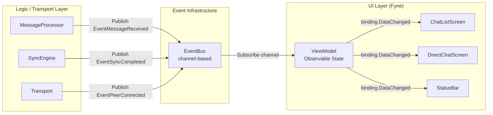
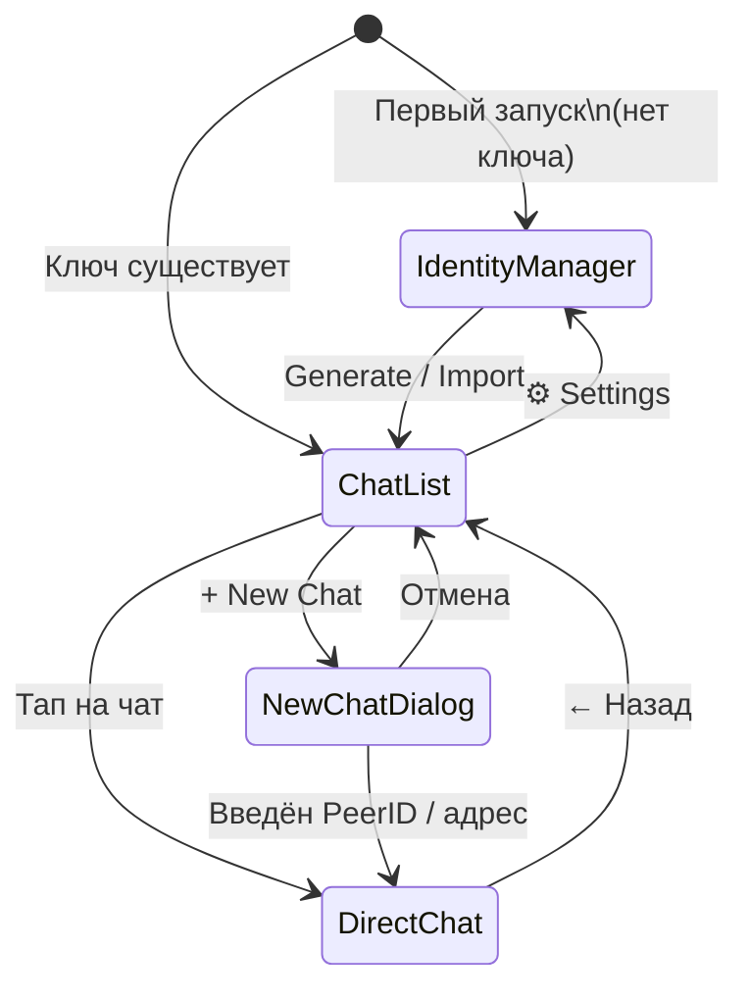

# 02_DES_ui_ux_fyne.md — UI/UX архитектура Aether (Fyne)

**Статус:** Design / Draft  
**Дата:** 2026-03-17  
**Зависит от:** `02_DES_architecture_v1.md`

---

## Оглавление

1. [Observable-архитектура GUI](#1-observable-архитектура-gui)
2. [Экран Identity Manager](#2-экран-identity-manager)
3. [Экран Chat List](#3-экран-chat-list)
4. [Экран Direct Chat](#4-экран-direct-chat)
5. [Навигация между экранами](#5-навигация-между-экранами)

---

## 1. Observable-архитектура GUI

### 1.1 Принцип: UI никогда не читает БД напрямую



**Правила:**
- UI = только чтение из `ViewModel` (binding)
- `ViewModel` = подписчик на `EventBus`, опрашивает `ChatService` при изменении
- P2P / Storage слои **не импортируют** пакет `fyne.io`

### 1.2 ViewModel — Observable State

```go
package viewmodel

import (
    "context"
    "sync"

    "fyne.io/fyne/v2/data/binding"
    "github.com/user/aether/internal/api"
    "github.com/user/aether/internal/event"
)

// ChatListViewModel — состояние экрана списка чатов.
type ChatListViewModel struct {
    Conversations binding.UntypedList // []ConversationDTO — Fyne observable
    NodeStatus    binding.String      // "online" | "relay" | "offline"
    UnreadCount   binding.Int

    chatSvc api.ChatService
    nodeSvc api.NodeService
    bus     event.EventBus
    mu      sync.Mutex
}

func NewChatListViewModel(chatSvc api.ChatService, nodeSvc api.NodeService, bus event.EventBus) *ChatListViewModel {
    vm := &ChatListViewModel{
        Conversations: binding.NewUntypedList(),
        NodeStatus:    binding.NewString(),
        UnreadCount:   binding.NewInt(),
        chatSvc:       chatSvc,
        nodeSvc:       nodeSvc,
        bus:           bus,
    }
    vm.NodeStatus.Set("offline")
    return vm
}

// Start запускает фоновый listener — НЕ блокирует UI goroutine.
func (vm *ChatListViewModel) Start(ctx context.Context) {
    msgCh := vm.bus.Subscribe(ctx, event.EventMessageReceived)
    syncCh := vm.bus.Subscribe(ctx, event.EventSyncCompleted)
    reachCh := vm.bus.Subscribe(ctx, event.EventNodeReachability)

    go func() {
        for {
            select {
            case <-ctx.Done():
                return

            case <-msgCh:
                // Новое сообщение — обновить список чатов
                vm.refreshConversations(ctx)

            case <-syncCh:
                // Синхронизация завершена — полный рефреш
                vm.refreshConversations(ctx)

            case ev := <-reachCh:
                // Обновить иконку статуса ноды
                r, _ := ev.Payload.(transport.NetworkReachability)
                switch r {
                case transport.ReachabilityPublic:
                    vm.NodeStatus.Set("online")     // зелёный
                case transport.ReachabilityPrivate:
                    vm.NodeStatus.Set("relay")       // жёлтый
                default:
                    vm.NodeStatus.Set("offline")     // красный
                }
            }
        }
    }()

    // Первоначальная загрузка
    vm.refreshConversations(ctx)
}

func (vm *ChatListViewModel) refreshConversations(ctx context.Context) {
    convs, err := vm.chatSvc.ListConversations(ctx)
    if err != nil {
        return
    }
    // binding.UntypedList обновляется в любой горутине — Fyne thread-safe
    items := make([]interface{}, len(convs))
    for i, c := range convs {
        items[i] = c
    }
    vm.Conversations.Set(items)

    // Пересчитать unread
    unread := 0
    for _, c := range convs {
        unread += c.UnreadCount
    }
    vm.UnreadCount.Set(unread)
}
```

```go
// DirectChatViewModel — состояние экрана конкретного чата.
type DirectChatViewModel struct {
    Messages    binding.UntypedList // []MessageDTO
    PeerOnline  binding.Bool
    PeerName    binding.String
    IsTyping    binding.Bool        // резерв для будущей фичи

    conversationID string
    chatSvc        api.ChatService
    bus            event.EventBus
}

func (vm *DirectChatViewModel) Start(ctx context.Context) {
    msgCh := vm.bus.Subscribe(ctx, event.EventMessageReceived)
    deliverCh := vm.bus.Subscribe(ctx, event.EventMessageDelivered)
    readCh := vm.bus.Subscribe(ctx, event.EventMessageRead)
    peerCh := vm.bus.Subscribe(ctx, event.EventPeerConnected)

    go func() {
        for {
            select {
            case <-ctx.Done():
                return
            case ev := <-msgCh:
                p := ev.Payload.(event.MessageReceivedPayload)
                if p.ConversationID == vm.conversationID {
                    vm.loadMessages(ctx)
                }
            case <-deliverCh:
                vm.loadMessages(ctx) // обновить иконки статуса
            case <-readCh:
                vm.loadMessages(ctx)
            case ev := <-peerCh:
                p := ev.Payload.(event.PeerConnectedPayload)
                if p.PeerID == vm.conversationID {
                    vm.PeerOnline.Set(true)
                }
            }
        }
    }()

    vm.loadMessages(ctx)
}

func (vm *DirectChatViewModel) loadMessages(ctx context.Context) {
    req := &api.GetMessagesRequest{
        ConversationID: vm.conversationID,
        Limit:          50,
    }
    msgs, err := vm.chatSvc.GetMessages(ctx, req)
    if err != nil {
        return
    }
    items := make([]interface{}, len(msgs))
    for i, m := range msgs {
        items[i] = m
    }
    vm.Messages.Set(items)
}
```

### 1.3 EventBus — channel-based реализация

```go
package event

import (
    "context"
    "sync"
)

type channelBus struct {
    mu          sync.RWMutex
    subscribers map[EventType][]chan Event
}

func NewEventBus(ctx context.Context) EventBus {
    bus := &channelBus{
        subscribers: make(map[EventType][]chan Event),
    }
    go bus.cleanup(ctx)
    return bus
}

// Publish публикует событие НЕБЛОКИРУЮЩЕ — если подписчик не успевает, событие теряется.
// Для мессенджера это допустимо: следующий Sync подберёт пропущенное.
func (b *channelBus) Publish(ev Event) {
    b.mu.RLock()
    subs := b.subscribers[ev.Type]
    b.mu.RUnlock()

    for _, ch := range subs {
        select {
        case ch <- ev:
        default: // non-blocking: подписчик занят — пропускаем
        }
    }
}

func (b *channelBus) Subscribe(ctx context.Context, t EventType) <-chan Event {
    ch := make(chan Event, 16) // буфер 16 — сглаживает пики входящих
    b.mu.Lock()
    b.subscribers[t] = append(b.subscribers[t], ch)
    b.mu.Unlock()

    // Автоматически удалить подписку при отмене контекста
    go func() {
        <-ctx.Done()
        b.unsubscribe(t, ch)
        close(ch)
    }()

    return ch
}
```

---

## 2. Экран Identity Manager

### 2.1 Назначение и UX-сценарии

| Сценарий | Действие пользователя |
|---|---|
| Первый запуск | Нажать "Generate New Identity" |
| Восстановление | Нажать "Import Key" → выбрать файл `.aether-key` |
| Экспорт ключа | Нажать "Export Key" → сохранить зашифрованный файл |
| Привязка к Personal Node | Ввести адрес ноды, нажать "Link" |

### 2.2 Макет экрана

```
┌──────────────────────────────────────────────┐
│  ⚡ Aether — Identity Manager                 │
├──────────────────────────────────────────────┤
│                                              │
│  🔑 Your Identity                            │
│  ┌──────────────────────────────────────┐   │
│  │ Device ID:                           │   │
│  │ 12D3KooWA7SzWkReXm...  [Copy]        │   │
│  │                                      │   │
│  │ Status: ● Active                     │   │
│  └──────────────────────────────────────┘   │
│                                              │
│  [Generate New Identity]  [Import Key ↑]    │
│  [Export Key ↓]                             │
│                                              │
│  ─────────────────────────────────────────  │
│  🖥  Personal Node                           │
│  ┌──────────────────────────────────────┐   │
│  │ Node Address:  [__________________]  │   │
│  │ /ip4/1.2.3.4/udp/4001/quic-v1/p2p/… │   │
│  └──────────────────────────────────────┘   │
│  [Link Node]          Status: ● Connected   │
│                                              │
└──────────────────────────────────────────────┘
```

### 2.3 Реализация (Fyne)

```go
package screens

import (
    "context"
    "fyne.io/fyne/v2"
    "fyne.io/fyne/v2/container"
    "fyne.io/fyne/v2/dialog"
    "fyne.io/fyne/v2/theme"
    "fyne.io/fyne/v2/widget"
    "github.com/user/aether/internal/api"
)

type IdentityScreen struct {
    nodeSvc api.NodeService
    win     fyne.Window

    deviceIDLabel *widget.Label
    nodeAddrEntry *widget.Entry
    statusLabel   *widget.Label
}

func NewIdentityScreen(nodeSvc api.NodeService, win fyne.Window) *IdentityScreen {
    return &IdentityScreen{nodeSvc: nodeSvc, win: win}
}

func (s *IdentityScreen) Build(ctx context.Context) fyne.CanvasObject {
    status, _ := s.nodeSvc.GetStatus(ctx)

    s.deviceIDLabel = widget.NewLabelWithStyle(
        truncate(status.DeviceID, 32)+"…",
        fyne.TextAlignLeading, fyne.TextStyle{Monospace: true},
    )

    copyBtn := widget.NewButtonWithIcon("Copy", theme.ContentCopyIcon(), func() {
        s.win.Clipboard().SetContent(status.DeviceID)
    })

    identityCard := widget.NewCard("Your Identity", "",
        container.NewVBox(
            container.NewHBox(s.deviceIDLabel, copyBtn),
            widget.NewLabel("Status: ● Active"),
        ),
    )

    genBtn := widget.NewButton("Generate New Identity", func() {
        dialog.ShowConfirm("Warning",
            "This will replace your current identity. Are you sure?",
            func(ok bool) {
                if ok {
                    s.nodeSvc.GenerateIdentity(ctx)
                }
            }, s.win)
    })

    importBtn := widget.NewButton("Import Key ↑", func() {
        dialog.ShowFileOpen(func(r fyne.URIReadCloser, err error) {
            if r == nil || err != nil {
                return
            }
            defer r.Close()
            s.nodeSvc.ImportIdentity(ctx, r)
        }, s.win)
    })

    exportBtn := widget.NewButton("Export Key ↓", func() {
        dialog.ShowFileSave(func(w fyne.URIWriteCloser, err error) {
            if w == nil || err != nil {
                return
            }
            defer w.Close()
            s.nodeSvc.ExportIdentity(ctx, w)
        }, s.win)
    })

    s.nodeAddrEntry = widget.NewEntry()
    s.nodeAddrEntry.SetPlaceHolder("/ip4/1.2.3.4/udp/4001/quic-v1/p2p/…")
    if status.PersonalNodeAddr != "" {
        s.nodeAddrEntry.SetText(status.PersonalNodeAddr)
    }

    s.statusLabel = widget.NewLabel("Status: ● Disconnected")
    if status.PersonalNodeOnline {
        s.statusLabel.SetText("Status: ● Connected")
    }

    linkBtn := widget.NewButton("Link Node", func() {
        addr := s.nodeAddrEntry.Text
        if err := s.nodeSvc.SetPersonalNode(ctx, &api.SetPersonalNodeRequest{Addr: addr}); err != nil {
            dialog.ShowError(err, s.win)
            return
        }
        s.statusLabel.SetText("Status: ● Connecting…")
    })

    nodeCard := widget.NewCard("Personal Node", "",
        container.NewVBox(
            s.nodeAddrEntry,
            container.NewHBox(linkBtn, s.statusLabel),
        ),
    )

    return container.NewVBox(
        identityCard,
        container.NewHBox(genBtn, importBtn, exportBtn),
        widget.NewSeparator(),
        nodeCard,
    )
}
```

---

## 3. Экран Chat List

### 3.1 Макет экрана

```
┌──────────────────────────────────────────────┐
│  💬 Aether             [●] Online  [⚙ Menu]  │
├──────────────────────────────────────────────┤
│  🔍 Search contacts...                       │
├──────────────────────────────────────────────┤
│  ┌────────────────────────────────────────┐  │
│  │ 👤 Alice                 14:32    [●]  │  │
│  │    "Hey, are you there?" [2]           │  │
│  ├────────────────────────────────────────┤  │
│  │ 👤 Bob                   Yesterday     │  │
│  │    "See you tomorrow!"                 │  │
│  ├────────────────────────────────────────┤  │
│  │ 👤 Carol                 Mon           │  │
│  │    "Thanks for the file"               │  │
│  └────────────────────────────────────────┘  │
│                                              │
│              [+ New Chat]                    │
└──────────────────────────────────────────────┘
```

### 3.2 Индикаторы статуса ноды

```
● зелёный  — ReachabilityPublic  → "Online" (прямое P2P)
● жёлтый   — ReachabilityPrivate → "Relay"  (через Circuit Relay)
● красный  — Disconnected        → "Offline" (нет сети)
```

### 3.3 Реализация (Fyne)

```go
type ChatListScreen struct {
    vm  *viewmodel.ChatListViewModel
    win fyne.Window
    nav func(conversationID string) // коллбек навигации
}

func NewChatListScreen(vm *viewmodel.ChatListViewModel, win fyne.Window, nav func(string)) *ChatListScreen {
    return &ChatListScreen{vm: vm, win: win, nav: nav}
}

func (s *ChatListScreen) Build(ctx context.Context) fyne.CanvasObject {
    s.vm.Start(ctx)

    // Индикатор статуса ноды (реагирует на EventBus через vm.NodeStatus)
    statusDot := widget.NewLabel("●")
    statusLabel := widget.NewLabel("Offline")
    s.vm.NodeStatus.AddListener(binding.NewDataListener(func() {
        status, _ := s.vm.NodeStatus.Get()
        switch status {
        case "online":
            statusDot.SetText("●") // зелёный через theme
            statusLabel.SetText("Online")
        case "relay":
            statusLabel.SetText("Relay")
        default:
            statusLabel.SetText("Offline")
        }
    }))

    header := container.NewBorder(nil, nil, nil,
        container.NewHBox(statusDot, statusLabel),
        widget.NewLabelWithStyle("Aether", fyne.TextAlignCenter, fyne.TextStyle{Bold: true}),
    )

    search := widget.NewEntry()
    search.SetPlaceHolder("🔍 Search contacts...")

    // Список чатов — data binding к vm.Conversations
    list := widget.NewListWithData(
        s.vm.Conversations,
        func() fyne.CanvasObject {
            return container.NewHBox(
                widget.NewIcon(theme.AccountIcon()),
                container.NewVBox(
                    widget.NewLabelWithStyle("", fyne.TextAlignLeading, fyne.TextStyle{Bold: true}),
                    widget.NewLabel(""),
                ),
                widget.NewLabel(""), // timestamp
            )
        },
        func(item binding.DataItem, obj fyne.CanvasObject) {
            uitem, _ := item.(binding.Untyped).Get()
            conv := uitem.(*api.ConversationDTO)
            box := obj.(*fyne.Container)

            nameLabel := box.Objects[1].(*fyne.Container).Objects[0].(*widget.Label)
            previewLabel := box.Objects[1].(*fyne.Container).Objects[1].(*widget.Label)
            timeLabel := box.Objects[2].(*widget.Label)

            nameLabel.SetText(conv.DisplayName)
            previewLabel.SetText(truncate(conv.LastMessagePreview, 40))
            timeLabel.SetText(formatTime(conv.LastMessageAt))
        },
    )

    list.OnSelected = func(id widget.ListItemID) {
        item, _ := s.vm.Conversations.GetItem(id)
        uitem, _ := item.(binding.Untyped).Get()
        conv := uitem.(*api.ConversationDTO)
        s.nav(conv.ID) // переход на экран чата
    }

    newChatBtn := widget.NewButtonWithIcon("New Chat", theme.ContentAddIcon(), func() {
        s.showNewChatDialog(ctx)
    })

    return container.NewBorder(
        container.NewVBox(header, search),
        newChatBtn,
        nil, nil,
        list,
    )
}
```

---

## 4. Экран Direct Chat

### 4.1 Макет экрана

```
┌──────────────────────────────────────────────┐
│  ← Alice                    [●] Online       │
├──────────────────────────────────────────────┤
│                                              │
│                ┌─────────────────────────┐  │
│                │  Hey, are you there?    │  │
│                │         14:31  ✓✓      │  ← read receipts
│                └─────────────────────────┘  │
│  ┌───────────────────┐                      │
│  │  Yes! Just got    │                      │
│  │  your message.    │                      │
│  │  14:32  ✓        │                      │← delivered
│  └───────────────────┘                      │
│                ┌─────────────────────────┐  │
│                │  Great! Talk later?     │  │
│                │         14:33  ✓✓      │  │
│                └─────────────────────────┘  │
│                                              │
├──────────────────────────────────────────────┤
│  [Type a message…]              [Send ➤]    │
└──────────────────────────────────────────────┘
```

### 4.2 Статусы сообщений

| Иконка | Статус | Значение |
|---|---|---|
| `✓` | `delivered` | Personal Node получил |
| `✓✓` (серые) | `delivered_to_device` | Целевое устройство получило |
| `✓✓` (синие) | `read` | Получатель прочитал |
| `⟳` | `sending` | В процессе отправки |
| `⚠` | `failed` | Ошибка отправки |

### 4.3 Реализация (Fyne)

```go
type DirectChatScreen struct {
    vm             *viewmodel.DirectChatViewModel
    conversationID string
    win            fyne.Window
    chatSvc        api.ChatService
}

func (s *DirectChatScreen) Build(ctx context.Context) fyne.CanvasObject {
    s.vm.Start(ctx)

    // Пузыри сообщений — data binding
    msgList := widget.NewListWithData(
        s.vm.Messages,
        func() fyne.CanvasObject {
            bubble := widget.NewCard("", "", widget.NewLabel(""))
            statusIcon := widget.NewLabel("")
            timeLabel := widget.NewLabel("")
            return container.NewHBox(bubble, container.NewVBox(timeLabel, statusIcon))
        },
        func(item binding.DataItem, obj fyne.CanvasObject) {
            uitem, _ := item.(binding.Untyped).Get()
            msg := uitem.(*api.MessageDTO)

            outer := obj.(*fyne.Container)
            bubble := outer.Objects[0].(*widget.Card)
            meta := outer.Objects[1].(*fyne.Container)
            timeLabel := meta.Objects[0].(*widget.Label)
            statusIcon := meta.Objects[1].(*widget.Label)

            bubble.SetContent(widget.NewLabel(msg.Text))
            timeLabel.SetText(formatTime(msg.SentAt))
            statusIcon.SetText(statusToIcon(msg.Status))

            // Выровнять: своё сообщение — справа, чужое — слева
            if msg.IsOwn {
                outer.Layout = layout.NewBorderLayout(nil, nil, widget.NewLabel(""), nil)
            }
        },
    )

    // Автопрокрутка вниз при новом сообщении
    s.vm.Messages.AddListener(binding.NewDataListener(func() {
        n := s.vm.Messages.Length()
        if n > 0 {
            msgList.ScrollToBottom()
        }
    }))

    // Поле ввода
    input := widget.NewMultiLineEntry()
    input.SetPlaceHolder("Type a message…")
    input.SetMinRowsVisible(2)

    sendBtn := widget.NewButtonWithIcon("Send", theme.MailSendIcon(), func() {
        text := input.Text
        if text == "" {
            return
        }
        input.SetText("")
        go func() {
            _, err := s.chatSvc.SendMessage(ctx, &api.SendMessageRequest{
                ConversationID: s.conversationID,
                Text:           text,
            })
            if err != nil {
                // Событие ошибки → EventBus → vm → UI
            }
        }()
    })

    // Отправка по Shift+Enter
    input.OnChanged = func(text string) {
        // резерв для typing indicator
    }

    inputRow := container.NewBorder(nil, nil, nil, sendBtn, input)

    // Заголовок
    peerName, _ := s.vm.PeerName.Get()
    header := container.NewHBox(
        widget.NewButtonWithIcon("", theme.NavigateBackIcon(), func() {
            // навигация назад
        }),
        widget.NewLabelWithStyle(peerName, fyne.TextAlignCenter, fyne.TextStyle{Bold: true}),
        widget.NewLabel("● Online"),
    )

    return container.NewBorder(header, inputRow, nil, nil, msgList)
}

func statusToIcon(status string) string {
    switch status {
    case "sending":
        return "⟳"
    case "delivered":
        return "✓"
    case "delivered_to_device":
        return "✓✓"
    case "read":
        return "✓✓" // синий — реализовать через кастомный виджет
    case "failed":
        return "⚠"
    default:
        return ""
    }
}
```

---

## 5. Навигация между экранами

### 5.1 Диаграмма экранов



### 5.2 Реализация навигации (stack-based)

```go
package ui

import (
    "fyne.io/fyne/v2"
    "fyne.io/fyne/v2/container"
)

// AppNavigator — стековая навигация без внешних зависимостей.
type AppNavigator struct {
    stack     []fyne.CanvasObject
    container *fyne.Container
    win       fyne.Window
}

func NewAppNavigator(win fyne.Window) *AppNavigator {
    c := container.NewMax()
    return &AppNavigator{container: c, win: win}
}

// Push добавляет экран на стек и отображает его.
func (n *AppNavigator) Push(screen fyne.CanvasObject) {
    n.stack = append(n.stack, screen)
    n.container.Objects = []fyne.CanvasObject{screen}
    n.container.Refresh()
}

// Pop возвращается к предыдущему экрану.
func (n *AppNavigator) Pop() {
    if len(n.stack) <= 1 {
        return
    }
    n.stack = n.stack[:len(n.stack)-1]
    prev := n.stack[len(n.stack)-1]
    n.container.Objects = []fyne.CanvasObject{prev}
    n.container.Refresh()
}

// Content возвращает корневой контейнер для app.Run().
func (n *AppNavigator) Content() fyne.CanvasObject {
    return n.container
}
```

```go
// Сборка приложения в NewApp.
func NewApp(cfg Config) *App {
    fyneApp := app.New()
    win := fyneApp.NewWindow("Aether")
    win.Resize(fyne.NewSize(400, 700))

    nav := NewAppNavigator(win)

    // Определяем, какой экран показывать первым
    chatListVM := viewmodel.NewChatListViewModel(cfg.Chat, cfg.Node, cfg.EventBus)
    chatListScreen := screens.NewChatListScreen(chatListVM, win, func(convID string) {
        chatVM := viewmodel.NewDirectChatViewModel(convID, cfg.Chat, cfg.EventBus)
        directScreen := screens.NewDirectChatScreen(chatVM, convID, win, cfg.Chat)
        nav.Push(directScreen.Build(context.Background()))
    })

    // Проверяем наличие ключа
    status, _ := cfg.Node.GetStatus(context.Background())
    if status.DeviceID == "" {
        identityScreen := screens.NewIdentityScreen(cfg.Node, win)
        nav.Push(identityScreen.Build(context.Background()))
    } else {
        nav.Push(chatListScreen.Build(context.Background()))
    }

    win.SetContent(nav.Content())

    return &App{win: win, fyneApp: fyneApp}
}
```

### 5.3 Принципы UI, которые соблюдает Aether

| Принцип | Реализация |
|---|---|
| **Decoupling** | P2P/Storage не импортируют `fyne.io` — только `internal/ui` |
| **Реактивность** | `binding.*` + `EventBus` → UI обновляется без polling |
| **Thread safety** | Все обновления binding — thread-safe; Fyne сам планирует refresh |
| **Testability** | ViewModel тестируется с моковым `ChatService` без Fyne |
| **Offline-first** | При недоступном PN — UI работает с локальной SQLite |

---

*Документы 02_DES_* завершены. Следующий шаг: реализация модулей согласно архитектуре.*
