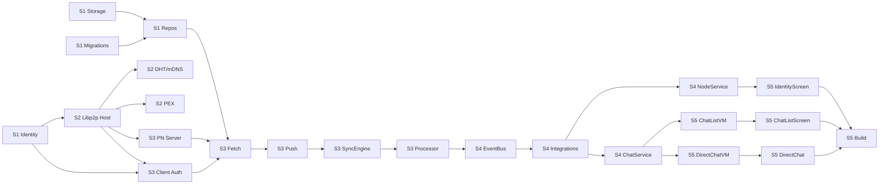

# 03_PLN_implementation_phases.md — План реализации Aether

**Статус:** Planning  
**Дата:** 2026-03-17  
**Зависит от:** `02_DES_architecture_v1.md`, `02_DES_sync_protocol.md`, `02_DES_ui_ux_fyne.md`

> **Принцип:** Каждый спринт завершается **работающим кодом**, который можно запустить и проверить — пусть и через консоль или тесты.

---

## Обзор спринтов

```mermaid
gantt
    title Aether — Roadmap
    dateFormat  W
    section Sprint 1
    Identity & Storage       :s1, W01, 2w
    section Sprint 2
    Transport Layer          :s2, after s1, 2w
    section Sprint 3
    Sync Engine              :s3, after s2, 2w
    section Sprint 4
    API & Event Bus          :s4, after s3, 1w
    section Sprint 5
    UI Layer (Fyne)          :s5, after s4, 2w
```

| Спринт | Название | Длительность | Deliverable |
|---|---|---|---|
| **S1** | Основание | 2 недели | Консольное приложение с ключами и БД |
| **S2** | Сеть | 2 недели | Два локальных узла обмениваются сообщениями |
| **S3** | Синхронизация | 2 недели | Personal Node принимает и раздаёт сообщения |
| **S4** | Мостик | 1 неделя | EventBus + API слой с тестами |
| **S5** | Визуализация | 2 недели | Полный Fyne GUI |

---

## Sprint 1 — Основание: Identity & Storage

**Цель:** Генерация Ed25519-ключей, стойкое хранение в keystore, инициализация SQLite с WAL-режимом и всеми миграциями.

### Задачи

```
[S1-01] Scaffolding проекта
  ├── Инициализировать go.mod (github.com/user/aether)
  ├── Создать структуру директорий (cmd/, internal/, proto/, docs/)
  └── Настроить Makefile: lint, test, build

[S1-02] internal/identity
  ├── Интерфейс IdentityManager
  ├── FileKeystore: хранение приватного ключа в зашифрованном файле
  ├── Ed25519 генерация через libp2p/core/crypto
  ├── Sign([]byte) / Verify(pubKey, data, sig)
  └── DeviceID() string → PeerID.String()

[S1-03] internal/storage — база данных
  ├── Open(path) + WAL + все PRAGMA из 01_RES_sqlite_p2p_consistency
  ├── Единственный writer connection + пул читателей
  └── db.Write(func(*sql.Tx) error) паттерн

[S1-04] internal/storage — миграции
  ├── Добавить golang-migrate/v4 + embed.FS
  ├── 000001_initial_schema.up.sql (messages, devices, contacts)
  ├── 000002_sync_state.up.sql (device_sync_state)
  └── RunMigrations(db) при старте

[S1-05] internal/storage — репозитории
  ├── MessageRepository: Save, GetSince, GetConversations
  ├── ContactRepository: Add, GetAll, UpdateAddr
  └── DeviceSyncRepository: GetLastSeq, UpdateLastSeq

[S1-06] cmd/aether — консольный smoke-test
  ├── main.go: OpenDB → RunMigrations → GenerateKey → PrintDeviceID
  └── Вывод: "Started as peer: 12D3KooW..."
```

### Зависимости

```
S1-01 → S1-02 → S1-06
S1-01 → S1-03 → S1-04 → S1-05 → S1-06
```

### Критерий завершения (Definition of Done)

- `go run ./cmd/aether` выводит PeerID в stdout
- `go test ./internal/identity/...` — 100% pass
- `go test ./internal/storage/...` — 100% pass
- SQLite-файл открывается в режиме WAL (проверяется через `PRAGMA journal_mode`)
- Повторный запуск загружает тот же ключ (стойкость keystore)

---

## Sprint 2 — Сеть: Transport Layer

**Цель:** Два экземпляра приложения на одном или разных хостах находят друг друга и обмениваются сырыми сообщениями через `/aether/direct/1.0.0`.

**Зависит от:** S1 полностью

### Задачи

```
[S2-01] internal/transport — интерфейсы
  ├── MessageTransport (из 02_DES_architecture_v1)
  ├── PeerDiscovery
  └── NetworkReachability enum

[S2-02] internal/transport — Libp2pTransport
  ├── NewHost: QUIC + TCP + Noise + yamux + connmgr
  ├── Enable DCUTR (hole punching, одна опция)
  ├── NATPortMap (UPnP/NAT-PMP)
  └── Send / Subscribe реализация (libp2p stream)

[S2-03] internal/transport — Discovery
  ├── InitDHT: dual DHT (WAN + LAN), ModeAutoServer
  ├── StartMDNS: "aether-messenger/1.0.0"
  └── SetupAutoNAT → публикует событие в канал

[S2-04] internal/transport — PEX
  ├── /aether/pex/1.0.0 stream handler
  ├── TrustedPeerStore (in-memory, персистится в БД contacts)
  └── RunPEXLoop (каждые 5 мин)

[S2-05] internal/transport — MockTransport
  ├── Реализует MessageTransport
  ├── SentMessages []SentMessage — инспектируемый буфер
  └── SimulateIncoming(from, payload) для тестов

[S2-06] cmd/aether — интеграционный тест в консоли
  ├── Запустить два процесса: Node A (порт 4001) и Node B (0 — случайный)
  ├── B находит A через mDNS → Connect → Send("hello")
  └── A получает и логирует: "from 12D3KooW...: hello"
```

### Зависимости

```
S1-02 → S2-02 (ключ нужен для libp2p Identity)
S2-01 → S2-02, S2-03, S2-04, S2-05
S2-02 → S2-03 → S2-04
S2-02 → S2-06
S2-05 → используется в тестах S3
```

### Критерий завершения

- mDNS: два локальных процесса находят друг друга за ≤5 сек
- QUIC соединение установлено (видно в логах)
- `go test ./internal/transport/...` с MockTransport — pass
- AutoNAT выводит статус: `Public/Private/Unknown`

---

## Sprint 3 — Синхронизация: Sync Engine

**Цель:** Personal Node сохраняет входящие сообщения; клиентский узел запрашивает их через Fetch-протокол, верифицирует Ed25519-подпись, сохраняет в SQLite.

**Зависит от:** S1, S2 полностью

### Задачи

```
[S3-01] proto/aether/sync.proto
  ├── Все сообщения из 02_DES_sync_protocol
  ├── Makefile цель: protoc → internal/proto/...
  └── Проверить: go generate ./proto/...

[S3-02] internal/sync — Handshake (серверная сторона)
  ├── PersonalNodeServer.handleSyncStream
  ├── AuthChallenge generation (crypto/rand 32 bytes)
  ├── Ed25519Verify через libp2p/core/crypto
  └── Whitelist проверка deviceID (из БД devices)

[S3-03] internal/sync — Handshake (клиентская сторона)
  ├── SyncClient.Authenticate(ctx) → stream
  ├── Sign(nonce) через identity.Sign()
  └── Обработка AuthResult.ok=false

[S3-04] internal/sync — Fetch алгоритм
  ├── SyncClient.FetchLoop (пагинация по global_seq)
  ├── PersonalNodeServer.handleFetch (GetSince → FetchResponse)
  ├── saveBatch: верификация подписи + дешифрование + INSERT OR IGNORE
  └── Exponential backoff при разрыве

[S3-05] internal/sync — Push
  ├── PersonalNodeServer: при получении нового msg → push всем онлайн-клиентам
  ├── SyncClient.ListenForPush: горутина на долгоживущем стриме
  └── AckRequest → UpdateLastSeq в БД

[S3-06] internal/sync — SyncEngine (оркестратор)
  ├── Start(ctx): Authenticate → FetchLoop → ListenForPush → reconnect
  ├── SetPersonalNode(nodeID, addr)
  └── OnSynced(handler func(int))

[S3-07] internal/logic — MessageProcessor
  ├── HandleIncoming: decrypt → verify → Save → Publish(EventMessageReceived)
  ├── Send: encrypt → Sign → Transport.Send
  └── Шифрование: X25519 ECDH + ChaCha20-Poly1305

[S3-08] Сценарный тест (консоль / tabletop)
  └── Node A → Personal Node (offline B) → B подключается → получает сообщение
```

### Зависимости

```
S2-02 → S3-02, S3-03 (stream через libp2p host)
S1-02 → S3-03 (подпись через identity)
S1-05 → S3-04 (GetSince, UpdateLastSeq в БД)
S3-02, S3-03 → S3-04 → S3-05 → S3-06
S3-07 зависит от S2-02 (Transport.Send) и S1-05 (Storage.Save)
```

### Критерий завершения

- Сценарий offline-доставки проходит end-to-end (S3-08)
- Подпись: невалидная сигнатура → сообщение отброшено
- Handshake с неизвестным deviceID → `AuthResult.ok=false`
- `INSERT OR IGNORE`: повторная доставка не создаёт дубликатов
- `go test ./internal/sync/... ./internal/logic/...` — pass

---

## Sprint 4 — Мостик: API & Event Bus

**Цель:** Связать бэкенд (Transport + Storage + Sync) с будущим UI через чистые интерфейсы API и реактивный EventBus.

**Зависит от:** S3 полностью

### Задачи

```
[S4-01] internal/event — EventBus
  ├── channelBus: map[EventType][]chan Event
  ├── Publish (non-blocking, select+default)
  ├── Subscribe(ctx, EventType) <-chan Event (буфер 16)
  └── auto-unsubscribe по ctx.Done()

[S4-02] Интеграция EventBus в Logic layer
  ├── MessageProcessor.HandleIncoming → bus.Publish(EventMessageReceived)
  ├── Transport AutoNAT → bus.Publish(EventNodeReachability)
  └── SyncEngine.OnSynced → bus.Publish(EventSyncCompleted)

[S4-03] internal/api — ChatService
  ├── ListConversations(ctx) → []ConversationDTO
  ├── GetMessages(ctx, req) → []MessageDTO
  └── SendMessage(ctx, req) → *MessageDTO

[S4-04] internal/api — NodeService
  ├── GetStatus(ctx) → *NodeStatus (reachability, peerCount, personalNode)
  ├── SetPersonalNode(ctx, req) → error
  ├── GenerateIdentity / ImportIdentity / ExportIdentity
  └── RegisterDevice(ctx, deviceID) — добавить устройство в whitelist PN

[S4-05] Тест EventBus
  ├── Publish → Subscribe: сообщение доставлено в канал за ≤10ms
  ├── Publish без подписчиков: не блокирует
  └── ctx.Cancel() → канал закрыт

[S4-06] Интеграционный тест API
  ├── MockTransport + InMemory SQLite + EventBus
  └── SendMessage → EventMessageReceived попадает в Subscribe канал
```

### Зависимости

```
S3-07 → S4-02 (интеграция event.Publish в Processor)
S1-05 → S4-03 (репозитории для ChatService)
S4-01 → S4-02 → S4-03, S4-04
S4-03, S4-04 → S4-06
```

### Критерий завершения

- EventBus: `go test ./internal/event/...` — pass
- API: `go test ./internal/api/...` с моками — pass
- `SendMessage` через MockTransport → событие в шине → проверяемо в тесте
- NodeService.GetStatus возвращает корректный ReachabilityStatus

---

## Sprint 5 — Визуализация: UI Layer (Fyne)

**Цель:** Полнофункциональный Fyne GUI: Identity Manager, Chat List, Direct Chat.

**Зависит от:** S4 полностью

### Задачи

```
[S5-01] internal/ui — AppNavigator
  ├── Push / Pop стек-навигация (из 02_DES_ui_ux_fyne)
  └── Первый экран: IdentityManager (нет ключа) / ChatList (есть ключ)

[S5-02] internal/ui/viewmodel — ChatListViewModel
  ├── binding.UntypedList → Conversations
  ├── binding.String → NodeStatus (green/yellow/red)
  └── Start(ctx): Subscribe EventBus → refreshConversations

[S5-03] internal/ui/viewmodel — DirectChatViewModel
  ├── binding.UntypedList → Messages
  ├── binding.Bool → PeerOnline
  └── loadMessages каждый раз при EventMessageReceived

[S5-04] internal/ui/screens — IdentityScreen
  ├── widget.Card с DeviceID + Copy кнопка
  ├── Generate / Import / Export кнопки
  └── Personal Node адрес + Link кнопка

[S5-05] internal/ui/screens — ChatListScreen
  ├── widget.NewListWithData → vm.Conversations
  ├── Статус-бар ноды (NodeStatus binding)
  └── Tap → Push DirectChatScreen

[S5-06] internal/ui/screens — DirectChatScreen
  ├── widget.NewListWithData → vm.Messages
  ├── Пузыри сообщений: IsOwn → выровнять вправо
  ├── Статусы: statusToIcon (⟳ ✓ ✓✓ ⚠)
  ├── Автопрокрутка: ScrollToBottom при новом сообщении
  └── Input + Send кнопка (горутина через ChatService.SendMessage)

[S5-07] Сборка cmd/aether с полным GUI
  ├── Подключить все компоненты через NewApp(Config{...})
  └── go build -o bin/aether ./cmd/aether
```

### Зависимости

```
S4-03, S4-04 → S5-02, S5-03 (API сервисы)
S4-01 → S5-02, S5-03 (EventBus Subscribe)
S5-02 → S5-05
S5-03 → S5-06
S5-01, S5-04, S5-05, S5-06 → S5-07
```

### Критерий завершения

- Полный GUI запускается без паник: `go run ./cmd/aether`
- IdentityManager генерирует ключ → переходит на ChatList
- ChatList обновляется при новом сообщении без перезапуска
- Direct Chat отправляет сообщение → оно появляется у второго узла (интеграционный сценарий)
- `fyne.io` не импортируется нигде за пределами `internal/ui`

---

## Сводная диаграмма зависимостей задач



---

*Следующий документ: `03_PLN_test_cases.md`*
