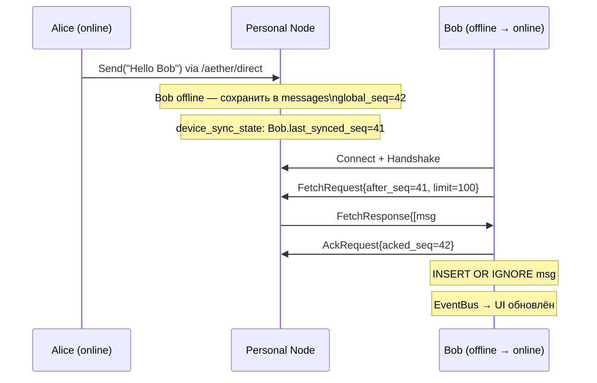

# 03_PLN_test_cases.md — Критерии приёмки и тест-кейсы Aether

**Статус:** Planning  
**Дата:** 2026-03-17  
**Зависит от:** `03_PLN_implementation_phases.md`, `02_DES_sync_protocol.md`

---

## Оглавление

1. [Критерии приёмки по спринтам](#1-критерии-приёмки-по-спринтам)
2. [Критические E2E тест-кейсы](#2-критические-e2e-тест-кейсы)
3. [Матрица покрытия](#3-матрица-покрытия)

---

## 1. Критерии приёмки по спринтам

### Sprint 1 — Identity & Storage

#### AC-S1-01: Генерация и стойкость ключей

```go
func TestIdentity_GenerateAndReload(t *testing.T) {
    dir := t.TempDir()
    mgr := identity.NewIdentityManager(filepath.Join(dir, "identity.key"))

    // Генерация
    id1, err := mgr.Generate()
    require.NoError(t, err)
    require.NotEmpty(t, id1.DeviceID())

    // Reload: тот же ключ
    id2, err := mgr.Load()
    require.NoError(t, err)
    assert.Equal(t, id1.DeviceID(), id2.DeviceID())
}
```

| # | Условие | Ожидаемый результат |
|---|---|---|
| AC-S1-01 | `Generate()` + `Load()` | Тот же DeviceID |
| AC-S1-02 | `Sign(data)` + `Verify(pubKey, data, sig)` | `true` |
| AC-S1-03 | `Verify` с изменённым data | `false` |
| AC-S1-04 | `Open(path)` + `PRAGMA journal_mode` | Возвращает `"wal"` |
| AC-S1-05 | `RunMigrations` дважды | Нет ошибки (`ErrNoChange`) |
| AC-S1-06 | `MessageRepository.Save` + `GetSince(afterSeq=0)` | Сообщение найдено |
| AC-S1-07 | `Save` с тем же `id` дважды | Только одна запись (`INSERT OR IGNORE`) |
| AC-S1-08 | `DeviceSyncRepository.UpdateLastSeq` + `GetLastSeq` | Значение обновлено |

---

### Sprint 2 — Transport Layer

#### AC-S2-01: mDNS-обнаружение (unit с таймаутом)

```go
func TestTransport_MDNSDiscovery(t *testing.T) {
    ctx, cancel := context.WithTimeout(context.Background(), 10*time.Second)
    defer cancel()

    hostA := newTestHost(t) // QUIC + mDNS
    hostB := newTestHost(t)

    discovered := make(chan peer.AddrInfo, 1)
    hostB.SetStreamHandler("/test/1.0.0", func(s network.Stream) {})

    // hostA должен обнаружить hostB через mDNS
    transport.StartMDNS(hostA, "aether-test", func(pi peer.AddrInfo) {
        if pi.ID == hostB.ID() {
            discovered <- pi
        }
    })

    select {
    case pi := <-discovered:
        assert.Equal(t, hostB.ID(), pi.ID)
    case <-ctx.Done():
        t.Fatal("mDNS: peer not discovered in 10s")
    }
}
```

| # | Условие | Ожидаемый результат |
|---|---|---|
| AC-S2-01 | Два хоста в LAN + mDNS | Обнаружение за ≤10 сек |
| AC-S2-02 | `Transport.Send` → `Subscribe` handler | Payload доставлен |
| AC-S2-03 | MockTransport.Send | Добавляется в `SentMessages` |
| AC-S2-04 | `AutoNAT.Reachability()` | Не паникует, возвращает не-nil |
| AC-S2-05 | QUIC соединение между двумя хостами | `ConnsToPeer(id) > 0` |
| AC-S2-06 | Соединение с несуществующим addr | `transport.ErrDialFailed` |
| AC-S2-07 | PEX: запрос от доверенного пира | Список пиров возвращён |
| AC-S2-08 | PEX: запрос от недоверенного пира | `Stream.Reset()`, ошибка |

---

### Sprint 3 — Sync Engine

#### AC-S3-01: Handshake — нормальный путь

```go
func TestHandshake_ValidDevice(t *testing.T) {
    ctx := context.Background()
    server, client := newSyncTestPair(t) // Personal Node + Client

    // Регистрируем ключ клиента на сервере
    server.RegisterDevice(client.DeviceID(), client.PublicKeyBytes())

    stream, err := client.Authenticate(ctx)
    require.NoError(t, err)
    assert.NotNil(t, stream)
}
```

| # | Условие | Ожидаемый результат |
|---|---|---|
| AC-S3-01 | Handshake, device зарегистрирован | `AuthResult.ok=true`, stream открыт |
| AC-S3-02 | Handshake, device НЕ зарегистрирован | `AuthResult.ok=false, "device not registered"` |
| AC-S3-03 | Handshake, подпись повреждена | `AuthResult.ok=false, "invalid signature"` |
| AC-S3-04 | Handshake после `expires_at` | `"challenge expired"` |
| AC-S3-05 | FetchLoop: нет новых сообщений | `FetchResponse.messages=[]`, no err |
| AC-S3-06 | FetchLoop: 250 сообщений (3 батча по 100) | Все 250 сохранены, last_synced_seq=250 |
| AC-S3-07 | saveBatch: невалидная Ed25519-подпись | Сообщение пропущено, остальные сохранены |
| AC-S3-08 | saveBatch: одно сообщение дважды | Ровно 1 запись в БД |
| AC-S3-09 | Push: PN отправляет новое сообщение | Клиент получает за ≤500 мс |
| AC-S3-10 | SyncEngine reconnect: stream разорван | Переподключение через 2 сек |

---

### Sprint 4 — API & Event Bus

| # | Условие | Ожидаемый результат |
|---|---|---|
| AC-S4-01 | `bus.Publish(event)` → `Subscribe(ctx, type)` | Событие в канале за ≤10 мс |
| AC-S4-02 | `Publish` без подписчиков | Не блокирует (≤1 мс) |
| AC-S4-03 | `Subscribe(cancelledCtx)` | Канал закрыт при Done() |
| AC-S4-04 | `ChatService.ListConversations` | Список отсортирован по `last_message_at DESC` |
| AC-S4-05 | `ChatService.SendMessage` | EventMessageReceived в шине |
| AC-S4-06 | `NodeService.GetStatus` при Private NAT | `Reachability = Private` |
| AC-S4-07 | `NodeService.RegisterDevice` | Устройство добавлено в whitelist PN |
| AC-S4-08 | `GetMessages(limit=50)` | Ровно 50 записей (не больше) |

---

### Sprint 5 — UI Layer

| # | Условие | Ожидаемый результат |
|---|---|---|
| AC-S5-01 | Запуск без ключа | Отображается IdentityManager |
| AC-S5-02 | Нажать "Generate" → перезапуск | Отображается ChatList с корректным DeviceID |
| AC-S5-03 | fyne.io в transport/storage пакетах | `go list -deps ./internal/transport/...` не содержит `fyne.io` |
| AC-S5-04 | EventBus → ChatListViewModel | `vm.Conversations.Length()` увеличивается без `Refresh()` вручную |
| AC-S5-05 | `NodeStatus = "relay"` | Лейбл статуса обновляется без перезапуска |
| AC-S5-06 | DirectChat: входящее сообщение | Прокрутка к новому сообщению автоматически |
| AC-S5-07 | DirectChat: статус `read` | Иконка меняется с `✓✓` (серая) на `✓✓` (синяя) |

---

## 2. Критические E2E тест-кейсы

### TC-001: Offline доставка через Personal Node

**Сценарий:** Сообщение отправлено пока получатель оффлайн → PN сохраняет → получатель подключается → сообщение доставлено.



**Шаги:**

1. Запустить Personal Node (`aetherd`)
2. Alice и PN авторизованы между собой
3. Bob зарегистрирован на PN, но offline
4. Alice отправляет "Hello Bob" через PN
5. PN сохраняет: `messages.global_seq=42`
6. Bob подключается: Handshake ✓
7. Bob запрашивает: `FetchRequest{after_seq=41}`
8. Bob получает msg#42, сохраняет, ACK

**Критерии прохождения:**

- PN: `SELECT COUNT(*) FROM messages WHERE id=<msg_id>` = 1
- Bob: то же на его устройстве = 1
- Bob: `device_sync_state.last_synced_seq = 42`
- Bob: EventBus содержит `EventMessageReceived{MessageID: <msg_id>}`
- Время с момента подключения Bob до получения сообщения: **≤ 2 сек**

---

### TC-002: Connection Migration (смена IP)

**Сценарий:** Устройство меняет IP-адрес (WiFi → мобильная сеть) → QUIC-соединение не разрывается благодаря Connection ID.

```
До:  Alice (/ip4/192.168.1.5/udp/4001) ──QUIC──► Bob
     [Alice переключается на мобильную сеть]
После: Alice (/ip4/10.0.0.2/udp/52341) ──QUIC──► Bob
       [Соединение продолжается без реконнекта]
```

**Шаги теста:**

```go
func TestQUIC_ConnectionMigration(t *testing.T) {
    if testing.Short() {
        t.Skip("requires network manipulation")
    }

    ctx, cancel := context.WithTimeout(context.Background(), 30*time.Second)
    defer cancel()

    hostA := newQUICHost(t, "/ip4/127.0.0.1/udp/0/quic-v1")
    hostB := newQUICHost(t, "/ip4/127.0.0.1/udp/0/quic-v1")

    // Установить соединение
    err := hostA.Connect(ctx, peer.AddrInfo{ID: hostB.ID(), Addrs: hostB.Addrs()})
    require.NoError(t, err)

    // Отправить первое сообщение
    err = sendTestMessage(ctx, hostA, hostB.ID(), []byte("before migration"))
    require.NoError(t, err)

    initialConns := hostA.Network().ConnsToPeer(hostB.ID())
    assert.Len(t, initialConns, 1)

    // Симулировать смену IP: bindTo новый адрес
    // (в реальной сети: отключить WiFi, QUIC использует Connection ID)
    // В тесте проверяем: соединение живо после 5 сек без активности
    time.Sleep(5 * time.Second)

    // Соединение должно быть живо
    liveConns := hostA.Network().ConnsToPeer(hostB.ID())
    assert.Len(t, liveConns, 1, "QUIC connection should survive without activity")

    // Отправить второе сообщение
    err = sendTestMessage(ctx, hostA, hostB.ID(), []byte("after idle"))
    require.NoError(t, err)
}
```

**Критерии прохождения:**

- Соединение **не разрывается** при смене IP (QUIC Connection ID)
- Второе сообщение доставлено на том же Connection
- Latency второго сообщения: ≤ latency первого × 1.5
- Лог НЕ содержит `reconnecting` между двумя сообщениями

> **Примечание:** Полноценное тестирование смены IP требует network namespace manipulation (Linux). В CI: запускать с тегом `-tags integration`.

---

### TC-003: Handshake — невалидный DeviceID

**Сценарий:** Устройство не зарегистрировано на Personal Node → Handshake отклонён → соединение закрыто.

```go
func TestHandshake_UnknownDevice(t *testing.T) {
    ctx, cancel := context.WithTimeout(context.Background(), 10*time.Second)
    defer cancel()

    pnHost := newTestHost(t)
    server := sync.NewPersonalNodeServer(pnHost, sync.TrustedDevices{
        // Пустой whitelist — ни одно устройство не зарегистрировано
    }, msgRepo, syncRepo)
    pnHost.SetStreamHandler(sync.SyncProtocolID, server.HandleSyncStream)

    // Неизвестный клиент пытается авторизоваться
    unknownHost := newTestHost(t)
    unknownIdentity, _ := identity.NewIdentityManager(t.TempDir()).Generate()
    client := sync.NewSyncClient(unknownHost, unknownIdentity, pnHost.ID())

    stream, err := client.Authenticate(ctx)

    // Ожидаем ошибку авторизации
    assert.Error(t, err)
    assert.Contains(t, err.Error(), "device not registered")
    assert.Nil(t, stream)

    // Stream должен быть закрыт на стороне сервера
    time.Sleep(100 * time.Millisecond)
    conns := pnHost.Network().ConnsToPeer(unknownHost.ID())
    // Соединение может существовать (TCP/QUIC уровень), но stream закрыт
    for _, conn := range conns {
        assert.Empty(t, conn.GetStreams(), "all streams must be closed after failed auth")
    }
}
```

**Критерии прохождения:**

- `client.Authenticate()` возвращает `err != nil`
- Сообщение ошибки содержит `"device not registered"`
- Все libp2p-стримы к серверу закрыты после failed auth
- PN не создаёт записи в `device_sync_state` для неизвестного устройства
- PN-нода продолжает нормальную работу (не паникует)

---

### TC-004: Дубликация — идемпотентность при ресинке

**Сценарий:** Соединение прервалось после Fetch, но до ACK → Personal Node повторно отправляет те же сообщения → дубликатов нет.

```go
func TestSync_IdempotentSave(t *testing.T) {
    ctx := context.Background()
    db := storage.OpenInMemory(t)
    repo := storage.NewMessageRepository(db)

    msg := &storage.Message{
        ID:             "msg-abc-123",
        ConversationID: "conv-1",
        SenderID:       "peerA",
        Content:        []byte("hello"),
        GlobalSeq:      1,
        SentAt:         time.Now().UnixMilli(),
    }

    // Первое сохранение
    err := repo.Save(ctx, msg)
    require.NoError(t, err)

    // Повторное сохранение (симуляция ресинка)
    err = repo.Save(ctx, msg)
    require.NoError(t, err) // INSERT OR IGNORE — не должно быть ошибки

    // Проверяем: ровно одна запись
    msgs, err := repo.GetSince(ctx, "conv-1", 0, 10)
    require.NoError(t, err)
    assert.Len(t, msgs, 1, "duplicate message must be ignored")
}
```

**Критерии прохождения:**

- `Save` с тем же `id` не возвращает ошибку
- В базе ровно 1 запись с данным `id`
- `last_synced_seq` корректно обновлён до значения из последнего ACK

---

### TC-005: Relay — связь при Symmetric NAT

**Сценарий:** Alice и Bob за Symmetric NAT, DCUTR не работает → соединение через Circuit Relay v2.

```
Предусловия:
  - Alice: ReachabilityPrivate (AutoNAT)
  - Bob: ReachabilityPrivate (AutoNAT)
  - Доступен публичный Relay (в тестах: локальный relay-хост)
  - DCUTR hole punch принудительно отключён (test mode)

Ожидаемый путь:
  Alice → Relay ← Bob
  Alice.Send("ping") → доставлено Bob через relay
```

```go
func TestRelay_SymmetricNATFallback(t *testing.T) {
    if testing.Short() {
        t.Skip("relay integration test")
    }
    ctx, cancel := context.WithTimeout(context.Background(), 30*time.Second)
    defer cancel()

    // Поднять relay-ноду
    relayHost := newRelayHost(t)

    // Alice и Bob знают только relay (нет прямой видимости)
    alice := newHostBehindNAT(t, []peer.AddrInfo{{ID: relayHost.ID(), Addrs: relayHost.Addrs()}})
    bob := newHostBehindNAT(t, []peer.AddrInfo{{ID: relayHost.ID(), Addrs: relayHost.Addrs()}})

    // Bob резервирует слот на relay
    bobRelayAddr := reserveRelaySlot(t, ctx, bob, relayHost)

    // Alice соединяется с Bob через relay addr
    err := alice.Connect(ctx, peer.AddrInfo{
        ID:    bob.ID(),
        Addrs: []multiaddr.Multiaddr{bobRelayAddr},
    })
    require.NoError(t, err)

    // Отправить сообщение
    received := make(chan []byte, 1)
    bob.SetStreamHandler("/test/ping/1.0.0", func(s network.Stream) {
        data, _ := io.ReadAll(s)
        received <- data
    })

    sendViaDirect(t, ctx, alice, bob.ID(), []byte("ping-via-relay"))

    select {
    case data := <-received:
        assert.Equal(t, []byte("ping-via-relay"), data)
    case <-ctx.Done():
        t.Fatal("relay: message not received in 30s")
    }
}
```

**Критерии прохождения:**

- Соединение установлено через relay (адрес содержит `/p2p-circuit/`)
- `alice.Network().ConnsToPeer(bob.ID())` > 0
- Сообщение доставлено
- Latency: ≤ 500 мс (через relay в LAN-тесте)

---

## 3. Матрица покрытия

| Тест-кейс | Sprint | Тип | Компонент | Приоритет |
|---|---|---|---|---|
| TC-001 Offline-доставка | S3 | E2E Integration | Sync + Storage + Transport | 🔴 Critical |
| TC-002 Connection Migration | S2 | Integration | Transport (QUIC) | 🟡 High |
| TC-003 Невалидный DeviceID | S3 | Unit + Integration | Sync Handshake | 🔴 Critical |
| TC-004 Идемпотентность Save | S1 | Unit | Storage | 🔴 Critical |
| TC-005 Relay fallback | S2 | Integration | Transport (Circuit v2) | 🟡 High |
| AC-S1-01..08 | S1 | Unit | Identity + Storage | 🔴 Critical |
| AC-S2-01..08 | S2 | Unit + Integration | Transport | 🟡 High |
| AC-S3-01..10 | S3 | Unit + Integration | Sync | 🔴 Critical |
| AC-S4-01..08 | S4 | Unit | EventBus + API | 🟡 High |
| AC-S5-01..07 | S5 | Manual + Automation | UI | 🟢 Medium |

### Команды для запуска тестов

```bash
# Юнит-тесты всех пакетов
go test ./internal/... -v -count=1

# Только быстрые тесты (без интеграционных)
go test ./internal/... -short

# Интеграционные тесты (Transport + Sync)
go test ./internal/... -tags integration -timeout 60s

# Проверка отсутствия Fyne в не-UI пакетах
go list -f '{{range .Imports}}{{println .}}{{end}}' \
    ./internal/transport/... \
    ./internal/storage/... \
    ./internal/logic/... \
    ./internal/sync/... \
    ./internal/event/... \
    | grep fyne && echo "FAIL: fyne found in non-UI package" || echo "OK"

# Race detector (критично для EventBus + P2P горутин)
go test ./internal/... -race -count=1

# Проверка WAL mode
sqlite3 data/aether.db "PRAGMA journal_mode;" | grep -q wal && echo "WAL OK"
```

### Тестовые хелперы

```go
// testutil/storage.go — in-memory SQLite для тестов
package testutil

import (
    "testing"
    "github.com/user/aether/internal/storage"
)

func NewInMemoryDB(t *testing.T) *storage.DB {
    t.Helper()
    db, err := storage.Open(":memory:")
    if err != nil {
        t.Fatalf("open in-memory db: %v", err)
    }
    if err := storage.RunMigrations(db); err != nil {
        t.Fatalf("run migrations: %v", err)
    }
    t.Cleanup(func() { db.Close() })
    return db
}

// testutil/transport.go — MockTransport для тестов Logic/API
func NewMockTransport() *transport.MockTransport {
    return &transport.MockTransport{
        SentMessages: make([]transport.SentMessage, 0),
    }
}

// testutil/identity.go — тестовая идентичность
func NewTestIdentity(t *testing.T) *identity.Identity {
    t.Helper()
    mgr := identity.NewIdentityManager(filepath.Join(t.TempDir(), "key"))
    id, err := mgr.Generate()
    if err != nil {
        t.Fatalf("generate identity: %v", err)
    }
    return id
}
```

---

*Документы 03_PLN_* завершены. Все спринты и тест-кейсы задокументированы.*
